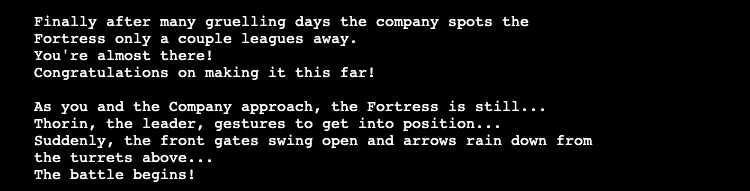
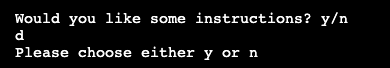
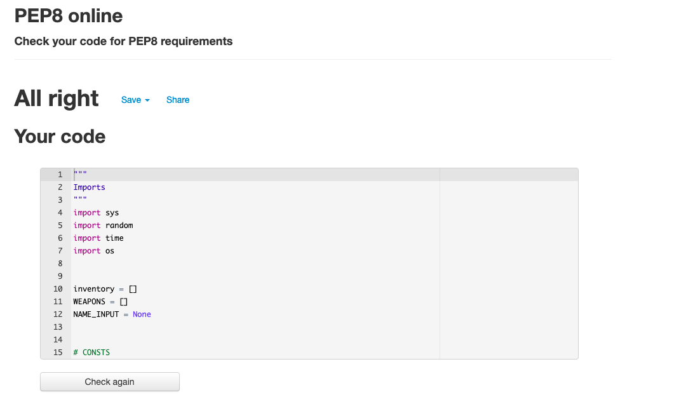

# The Hobbit Adventure Game

The live website can be found [here](https://the-hobbit-mya-game.herokuapp.com/).

 

## Table of Contents

- [Purpose](#purpose)
- [How to Play](#how-to-play)
- [UX & Stories](#user-experience--stories)
    - [User Goals](#user-goals)
    - [Flowchart](#flowchart)
    - [Design](#design)
        - [Colors](#colors)
        - [Font](#font)
- [Features](#features)
    - [Header](#header)
    - [Game Button](#game-button)
    - [Terminal](#terminal)
    - [Instructions](#instructions)
    - [Start Game Query](#start-game-query)
    - [Name Selection](#name-selection)
    - [Weapon Selection](#weapon-selection)
    - [First Battle](#first-battle)
    - [Post First Battle](#post-first-battle)
    - [Second Battle](#second-battle)
    - [Post Second Battle](#post-first-battle)
    - [Pre Third Battle](#pre-third-battle)
    - [Third Battle](#third-battle)
    - [Post Third Battle](#post-third-battle)
    - [Pre Fourth Battle](#pre-fourth-battle)
    - [Fourth Battle](#fourth-battle)
    - [Game End](#fourth-battle-end)
    - [Incorrect Responses](#incorrect-responses)
- [Technologies Used](#technologies-used)
- [Testing & Validation](#testing--validation)
    - [Manual Testing](#manual-testing)
    - [User Stories](#user-stories)
- [Future Implementations](#future-implementations)
- [Deployment](#deployment)
- [Credits](#credits)

## **Purpose**

This Hobbit adventure game was created for anyone interested in Tolkien's world of Middle Earth and/or text-based old school games.

## **How to Play**

Throughout this text-based game, the User will be presented with a number of choices. 
Other than the name input, these will either be `y`/`n` or `a`/`b`/`c`/`d` choices.
These are always validated by the terminal, and the User cannot continue until an accepted response is given. The User will be prompted to enter an accepted response if one is not entered. 
The User is offered instructions before starting the game proper.

Dependent on the User's chosen weapon and subsequent choices in battles, a number of traits can be collected. There are three negative and one positive trait. The negative traits will impact the outcome of various battles in a potentially detrimental way, whereas the positive traits (or absence of any traits) serve as a dialogue reward and make subsequent battles less likely to result in game over.

## **User Experience & Stories**

### **User Goals**

### **First Time User Goals**

- As a first time user, I want to easily understand what the site is for
- As a first time user, I want to enjoy playing a text-based adventure game
- As a first time user, I want to revisit the world of The Hobbit
- As a first time user, I want to understand how the game works

### **Returning User Goals**

- As a returning user, I want to see if I can finish the game with fewer negative traits and game overs than before
- As a returning user, I want to explore the different routes available in the game

### **Frequent User Goals**

- As a frequent user, I want to see if I can finish the game with no negative traits or game overs
- As a frequent user, I want to see if any battle have been expanded, or new battles have been added

### **Flowchart**

I created a flowchart to lay out the direction of the game and what various overall choices would result in.

## **Design**

I added two Hobbit-related messages while the game loads to help the User immerse in the story.

I centered the Play Game button and the terminal for a more appealing web design. 

### **Colors**

- Light purple #870fcc is used for the game title and the Play Game button background
- Dark purple #370753 is used for the Play Game button border
- Black #000000 was used in the background so it blends with the terminal
- White #ffffff was used for the Play Game button text

### **Font**

- The Reggae One font is used for the page title as I find this is a good standard fantasy-style font

## **Features**

### **Header**

The header is "The Hobbit Adventure Game" to inform the User of what the site is for.

### **Game Button**

The default Run Program button from the Code Institute template was renamed and restyled to fit the page styling.

### **Terminal**

The default terminal styling from the CI template was replaced with a centered terminal which sits below the Play Game button.

### **Instructions**

The User is presented with a y/n input request after the game blurb asking whether they would like instructions.
If the User selects `y`, they will be given instructions.
These inform the user on the sort of questions and required response inputs they can expect, as well as encouraging them to think carefully about their responses.

### **Start Game Query**

Following the instructions, the User is asked whether they would like to start the game or not. This allows for good UX as the User can choose whether to continue or not.

### **Name Selection**

The name selection is the only open input in the game. I added the .capitalize() method so the User's name is capitalized, regardless of whether they added their own capital letter. Having a name selection allows for a more personalised experience for the User. 

### **Weapon Selection**

After choosing a name, the User is given the first proper game choice - choosing a weapon. This is also the first abcd choice. This will influence the dialogue trees presented to the User in the rest of the game.
The User is given some information on their chosen weapon and informed that it has been added to their inventory.

### **First Battle**

The first battle contains prerequisite dialogue before the User is presented with another abcd option. The success of this battle is based on which weapon was chosen - each option corresponds with only one weapon. If the User chooses incorrectly, they will sustain an injury, which is added to their inventory.

### **Post First Battle**

Following this, the User is presented with another y/n option. Choosing correctly will progress the game, choosing incorrectly will result in a game over.

### **Second Battle**

The second battle begins with dialogue dependent on whether an injury was sustained in the previous battle or not. After, the User is presented with a y/n option. The success of this battle is based on the weapon and injury-status of the User's character. Choosing incorrectly will result in a game over.

### **Post Second Battle**

This post-battle does not contain any input requirements for the User. If they chose incorrectly in the past two battles, the User will be reminded of their weapon and character's accumulated traits. If the User chose correctly in the past two battles, they will be informed of their current success.

### **Pre Third Battle**

This runs dialogue about the battle that is about to happen, and allocates the User to one of three Third Battle trees dependent on their chosen weapon.

### **Third Battle**

The third battle presents the User with another y/n response. There are two potential game over paths here, dependent on the User's choice of weapon and responses in this battle and the previous ones.  
The User can acquire up to two negative traits and one positive trait.

### **Post Third Battle**

Before entering the final battle, the User is reminded of their characters weapon and any traits they have acquired along the way.

### **Pre Fourth Battle**

This runs dialogue about the final battle, congratulates the player on making it this far, and allocates them to a Fourth Battle path dependent on which traits (if any) have been acquired so far.

### **Fourth Battle**

The fourth, and final, battle has a number of paths dependent on how the User has faired so far. Regardless of path, the User will be presented with an abc response. The choice will either lead to victory, or a game over.

### **Fourth Battle End**

If the User survives the final battle, they will be congratulated, with the final line of dialogue hinting at more battles to come.

### **Game End**

Following the final battle, the program will game over. The User has the option to try again, or to quit the game.  
If the User chooses to play again, their inventory will be emptied.

### **Incorrect Responses**

If the User gives a response other than what is expected, they will receive a message based on the style of input and be asked to respond again.

## **Technologies Used**

- [Python](https://www.python.org)
- [HTML5](https://html.com/html5)
- [CSS](https://en.wikipedia.org/wiki/CSS)

- [Git](https://github.com/)
    - Used for version control through GitPod terminal with commits to GitHub and pushes to GitHub & Heroku
- [Heroku](https://www.heroku.com)
    - Used for deployed application
- [Chrome DevTools](https://developer.chrome.com/docs/devtools)
    - Used to work on HTML & CSS styling
- [LucidChart](https://www.lucidchart.com)
    - Used to create flowchart of game path
- [Stack Overflow](https://stackoverflow.com)
    - Used for troubleshooting Python issues
- [Sys](https://docs.python.org/3/library/sys.html)
    - Used on slowprint function
    - Used on game_over function to exit game
- [Time](https://docs.python.org/3/library/time.html)
    - Used for delay in slowprint function
- [Random](https://docs.python.org/3/library/random.html)
    - Used on slowprint function
- [os](https://docs.python.org/3/library/os.html?highlight=os#module-os)
    - Used to clear terminal

## **Testing & Validation**

- Game tested on both Mac and Windows to ensure everything ran smoothly.
- Game tested on Chrome, Safari & Firefox.
- Encountered various instances early on where if statements were not working correctly
    - For the most part, this was due to trailing white spaces at the beginning of lines.

Early on, passing the Python code through PEP8 returned no serious issues.  
However, it did return issues with line length - these were caused by nested if statements leading to longer lines due to indentation.  
This was fixed by changing the position of line breaks and paragraphing.  

Two linting errors present in code - both for the two global variables  
NAME_INPUT and  
WEAPONS  
No fix found at this stage, but will research further.  

PEP8 online test returned no issues.

Presented issues when using constants over "x in y":  
- Will look more into this so constants can be used to reduce repetition.  

The WRC Validator returned no issues for HTML or CSS:

### **Manual Testing**

- Game tested continuously by running through various options and responses (both correct and incorrect) to ensure User receives correct pathways and dialogue responses.  
- Ensured game over functioned correctly.  
- print(inventory) used before final deployment to check inventory was updating accurately.  

### **User Stories**

### First Time Stories  

*As a first time user, I want to easily understand what the site is for*  
    - Upon entering the game, the purpose of the site is immediately presented to the User with the Game Title and welcome message  

*As a first time user, I want to understand how the game works*  
    - The instructions option will inform the User of how the game works and what is expected of them  

*As a first time user, I want to revisit the world of The Hobbit*  
    - The game uses familiar names and monsters from The Hobbit to immerse the User  

*As a first time user, I want to enjoy playing a text-based adventure game*  
    - The game follows a steady pace so the User can easily follow along and enjoy the game

### Returning Stories  

*As a returning user, I want to explore the different routes available in the game*  
    - With previous knowledge, the User can follow different paths to see their outcomes  

*As a returning user, I want to see if I can finish the game with fewer negative traits and game overs than before*  
    - With previous knowledge, the User can avoid certain negative outcomes and see if they can improve upon their last play
    - The game is not too long, and the different paths avoid repetition, so the game remains interesting

### Frequent Stories  

*As a frequent user, I want to see if I can finish the game with no negative traits or game overs*  
    - With solid knowledge on the game, the User can be confident in their ability to aim for a perfect run  

## **Future Implementations**

- os.system('clear') only applicable to Gitpod bash - will research further if there is a similar method for clearing the deployed terminal

- Imagery and further styling to be added to enhance UX

- Option to end game at any stage, improving UX

## **Deployment**

This project was deployed using Heroku.  

Steps to deploy:
- Create or login to Heroku account
- Fork or clone this repository
    - In GitHub, locate the [repository](https://github.com/charlie-vf/the-hobbit-game) and click 'Fork' in the top right
    - This will create a copy of the repo in your account
- In Heroku, click 'new' in the top right and select 'new app' from the dropdown
- Give your app a name and click 'Create'
- Navigate to settings and select 'buildpacks'
- Add python and node.js, ensuring they are displayed in that order (python above)
- Navigate to 'Deploy'
- Navigate to 'Deployment Method' and connect to GitHub account
- Search for your GitHub repository and connect it
- Choose either Automatic or Manual deployment (Automatic will work inline with pushes from GitHub)
- Ensure 'branch to deploy' is master/main
- Hit deploy

## **Credits**

- The code for slowprint() was taken from stack overflow [here](https://stackoverflow.com/questions/15375368/slow-word-by-word-terminal-printing-in-python#:~:text=import%20random%20import%20sys%20import%20time%20def%20slowprint,between%20lines%20to%20add%20more%20dramatic%20effect.%20Share) with the time altered to be slightly slower

- My tutor, Brian Macchiara, for continued support and good chats

