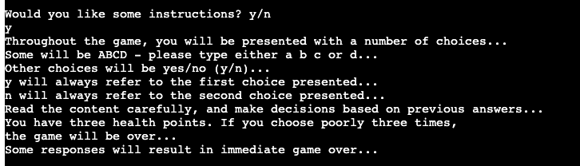
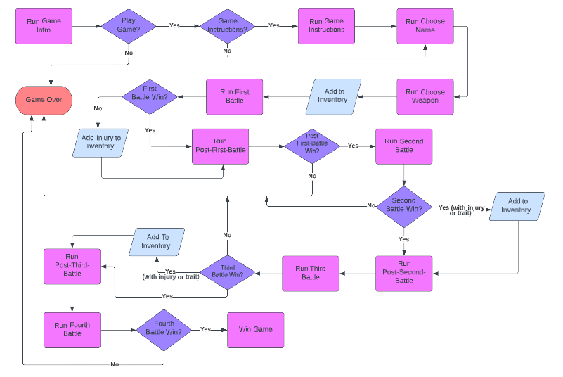
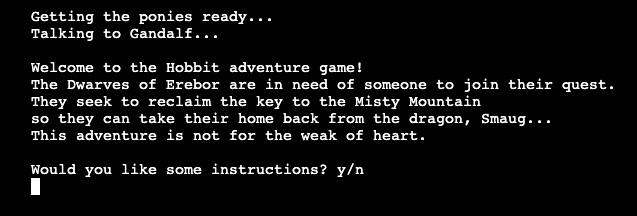
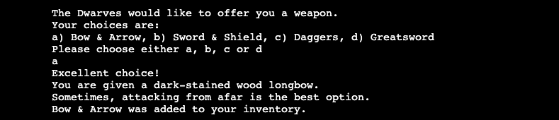
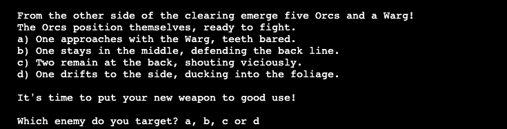
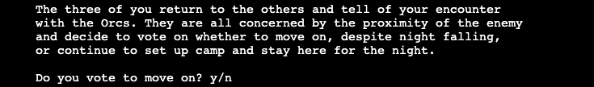
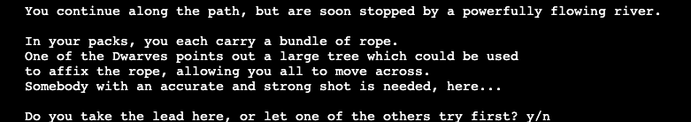
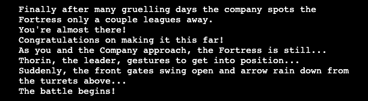
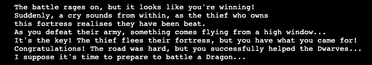
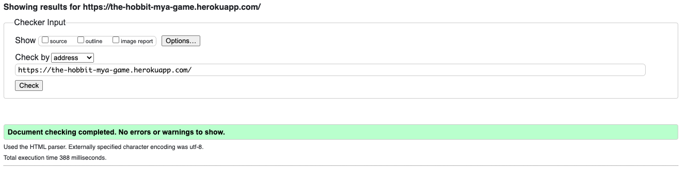

# The Hobbit Adventure Game

The live website can be found [here](https://the-hobbit-mya-game.herokuapp.com/).

 

## Table of Contents

- [Purpose](#purpose)
- [How to Play](#how-to-play)
- [UX & Stories](#user-experience--stories)
    - [User Goals](#user-goals)
    - [Flowchart](#flowchart)
    - [Design](#design)
        - [Colors](#colors)
        - [Font](#font)
- [Features](#features)
    - [Header](#header)
    - [Game Button](#game-button)
    - [Terminal](#terminal)
    - [Instructions](#instructions)
    - [Start Game Query](#start-game-query)
    - [Name Selection](#name-selection)
    - [Weapon Selection](#weapon-selection)
    - [First Battle](#first-battle)
    - [Post First Battle](#post-first-battle)
    - [Second Battle](#second-battle)
    - [Post Second Battle](#post-first-battle)
    - [Third Battle](#third-battle)
    - [Post Third Battle](#post-third-battle)
    - [Fourth Battle](#fourth-battle)
    - [Game End](#fourth-battle-end)
- [Testing & Validation](#testing--validation)

## **Purpose**

This Hobbit adventure game was created for anyone interested in Tolkien's world of Middle Earth and/or text-based old school games.

## **How to Play**

Throughout this text-based game, the User will be presented with a number of choices. 
Other than the name input, these will either be `y`/`n` or `a`/`b`/`c`/`d` choices.
These are always validated by the terminal, and the User cannot continue until an accepted response is given. The User will be prompted to enter an accepted response if one is not entered. 
The User is offered instructions before starting the game proper.

Dependent on the User's chosen weapon and subsequent choices in battles, a number of traits can be collected. There are three negative and one positive trait. The negative traits will impact the outcome of various battles in a potentially detrimental way, whereas the positive traits (or absence of any traits) serve as a dialogue reward and make subsequent battles less likely to result in game over.

## **User Experience & Stories**

### **User Goals**

### **First Time User Goals**

- As a first time user, I want to easily understand what the site is for
- As a first time user, I want to enjoy playing a text-based adventure game
- As a first time user, I want to revisit the world of The Hobbit
- As a first time user, I want to understand how the game works

### **Returning User Goals**

- As a returning user, I want to see if I can finish the game with fewer negative traits and game overs than before
- As a returning user, I want to explore the different routes available in the game

### **Frequent User Goals**

- As a frequent user, I want to see if I can finish the game with no negative traits or game overs
- As a frequent user, I want to see if any battle have been expanded, or new battles have been added

### **Flowchart**

I created a flowchart to lay out the direction of the game and what various overall choices would result in.

## **Design**

I added two Hobbit-related messages while the game loads to help the User immerse in the story.

I centered the Play Game button and the terminal for a more appealing web design. 

### **Colors**

- Light purple #870fcc is used for the game title and the Play Game button background
- Dark purple #370753 is used for the Play Game button border

### **Font**

- The Reggae One font is used for the page title as I find this is a good standard fantasy-style font

## **Features**

### **Header**

The header is "The Hobbit Adventure Game" to inform the User of what the site is for.

### **Game Button**

The default Run Program button from the Code Institute template was renamed and restyled to fit the page styling.

### **Terminal**

The default terminal styling from the CI template was replaced with a centered terminal which sits below the Play Game button.

### **Instructions**

The User is presented with a y/n input request after the game blurb asking whether they would like instructions.
If the User selects `y`, they will be given instructions.
These inform the user on the sort of questions and required response inputs they can expect, as well as encouraging them to think carefully about their responses.

### **Start Game Query**

Following the instructions, the User is asked whether they would like to start the game or not. This allows for good UX as the User can choose whether to continue or not.

### **Name Selection**

The name selection is the only open input in the game. I added the .capitalize() method so the User's name is capitalized, regardless of whether they added their own capital letter. Having a name selection allows for a more personalised experience for the User. 

### **Weapon Selection**

After choosing a name, the User is given the first proper game choice - choosing a weapon. This is also the first abcd choice. This will influence the dialogue trees presented to the User in the rest of the game.
The User is given some information on their chosen weapon and informed that it has been added to their inventory.

### **First Battle**

The first battle contains prerequisite dialogue before the User is presented with another abcd option. The success of this battle is based on which weapon was chosen - each option corresponds with only one weapon. If the User chooses incorrectly, they will sustain an injury, which is added to their inventory.

### **Post First Battle**

Following this, the User is presented with another y/n option. Choosing correctly will progress the game, choosing incorrectly will result in a game over.

### **Second Battle**

The second battle begins with dialogue dependent on whether an injury was sustained in the previous battle or not. After, the User is presented with a y/n option. The success of this battle is based on the weapon and injury-status of the User's character. Choosing incorrectly will result in a game over.

### **Post Second Battle**

This post-battle does not contain any input requirements for the User. If they chose incorrectly in the past two battles, the User will be reminded of their weapon and character's accumulated traits. If the User chose correctly in the past two battles, they will be informed of their current success.

### ** Pre Third Battle**

This runs dialogue about the battle that is about to happen, and allocates the User to one of three Third Battle trees dependent on their chosen weapon

### **Third Battle**

The third battle presents the User with another y/n response. There are two potential game over paths here, dependent on the User's choice of weapon and responses in this battle and the previous ones. 
The User can acquire up to two negative traits and one positive trait.

### **Post Third Battle**

Before entering the final battle, the User is reminded of their characters weapon and any traits they have acquired along the way.

### ** Pre Fourth Battle**

This runs dialogue about the final battle, congratulates the player on making it this far, and allocates them to a Fourth Battle path dependent on which traits (if any) have been acquired so far.

### **Fourth Battle**

The fourth, and final, battle has a number of paths dependent on how the User has faired so far. Regardless of path, the User will be presented with an abc response. The choice will either lead to victory, or a game over.

### **Fourth Battle End**

If the User survives the final battle, they will be congratulated, with the final line of dialogue hinting at more battles to come.

### **Game End**

Following the final battle, the program will game over. The User has the option to try again, or to quit the game. The terminal will clear after the response is given.

## **Testing & Validation**

- I tested this game on various viewport sizes, both Mac and Windows, to ensure everything ran smoothly.
    - This included the clear function in the game over function, which empties the terminal after the game over response is given.
- Encountered various instances where if statements were not working correctly
    - For the most part, this was due to trailing white spaces at the beginning of lines

Passing the Python code through PEP8 returned no serious issues.
However, it did return issues with line length - these were caused by nested if statements leading to longer lines due to indentation.
This was fixed by changing the position of line breaks and paragraphing.

Final PEP8 test returned two issues - both for the two global variables. Global variables necessary here, however.

Presented issues when using constants over "x in x":
- Will look more into this so constants can be used to reduce repetition

The WRC Validator returned no issues for HTML or CSS:

### **User Stories**

- First Time Stories
    - Upon entering the game, the purpose of the site is immediately presented to the User with the Game Title and welcome message
    - The instructions option will inform the User of how the game works and what is expected of them
    - The game uses familiar names and monsters from The Hobbit to immerse the User
    - The game follows a steady pace so the User can easily follow along and enjoy the game

- Returning Stories
    - With previous knowledge, the User can follow different paths to see their outcomes
    - With previous knowledge, the User can avoid certain negative outcomes and see if they can improve upon their last play
    - The game is not too long, and the different paths avoid repetition, so the game remains interesting

- Frequent Stories
    - With solid knowledge on the game, the User can be confident in their ability to aim for a perfect run

## **Credits**

- The code for slowprint() was taken from stack overflow [here](https://stackoverflow.com/questions/15375368/slow-word-by-word-terminal-printing-in-python#:~:text=import%20random%20import%20sys%20import%20time%20def%20slowprint,between%20lines%20to%20add%20more%20dramatic%20effect.%20Share)

