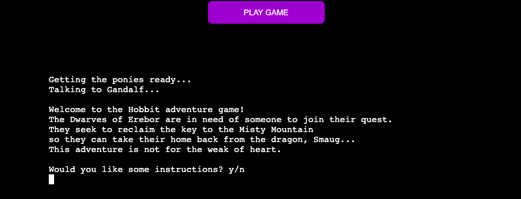

Slowprint tutorial: https://stackoverflow.com/questions/15375368/slow-word-by-word-terminal-printing-in-python#:~:text=import%20random%20import%20sys%20import%20time%20def%20slowprint,between%20lines%20to%20add%20more%20dramatic%20effect.%20Share

issues with if statements not rolling through properly
e.g. not going all the way through to the correct option despite not having the item conditions for the statement it stopped on in inventory

# The Hobbit Adventure Game

The live website can be found [here](https://the-hobbit-mya-game.herokuapp.com/).

 

## Table of Contents

## **Purpose**

This Hobbit adventure game was created for anyone interested in Tolkien's world of Middle Earth and/or text-based old school games.

## **How to Play**

Throughout this text-based game, the User will be presented with a number of choices. 
Other than the name input, these will either be `y`/`n` or `a`/`b`/`c`/`d` choices.
These are always validated by the terminal, and the User cannot continue until an accepted response is given. The User will be prompted to enter an accepted response if one is not entered. 
The User is offered instructions before starting the game proper.

Dependent on the User's chosen weapon and subsequent choices in battles, a number of traits can be collected. There are three negative and one positive trait. The negative traits will impact the outcome of various battles in a potentially detrimental way, whereas the positive traits (or absence of any traits) serve as a dialogue reward and make subsequent battles less likely to result in game over.

## **User Experience & Stories**

### **First Time User Goals**

- As a first time user, I want to easily understand what the site is for
- As a first time user, I want to enjoy playing a text-based adventure game
- As a first time user, I want to revisit the world of The Hobbit
**
### **Returning User Goals

- As a returning user, I want to see if I can finish the game with fewer negative traits and game overs than before
- As a returning user, I want to explore the different routes available in the game

### **Frequent User Goals**

- As a frequent user, I want to see if I can finish the game with no negative traits or game overs
- As a frequent user, I want to see if any battle have been expanded, or new battles have been added

### **Flowchart**

I created a flowchart to lay out the direction of the game and what various overall choices would result in.

## **Design**

I added two Hobbit-related messages while the game loads to help the User immerse in the story.

I centered the Play Game button and the terminal for a more appealing web design. 

### **Colors**

- Light purple #870fcc is used for the game title and the Play Game button background
- Dark purple #370753 is used for the Play Game button border

### **Font**

- The Reggae One font is used for the page title as I find this is a good standard fantasy-style font

## **Features**

### **Header**

The header is "The Hobbit Adventure Game" to inform the User of what the site is for.

### **Game Button**

The default Run Program button from the Code Institute template was renamed and restyled to fit the page styling.

### **Terminal**

The default terminal styling from the CI template was replaced with a centered terminal which sits below the Play Game button.

### **Instructions**

The User is presented with a y/n input request after the game blurb asking whether they would like instructions.
If the User selects `y`, they will be given instructions.
These inform the user on the sort of questions and required response inputs they can expect, as well as encouraging them to think carefully about their responses.

### **Start Game Query**

Following the instructions, the User is asked whether they would like to start the game or not. This allows for good UX as the User can choose whether to continue or not.

### **Name Selection**

The name selection is the only open input in the game. I added the .capitalize() method so the User's name is capitalized, regardless of whether they added their own capital letter.

### **Weapon Selection**

After choosing a name, the User is given the first proper game choice - choosing a weapon. This is also the first abcd choice. This will influence the dialogue trees presented to the User in the rest of the game.
The User is given some information on their chosen weapon and informed that it has been added to their inventory.

### **First Battle**

The first battle contains prerequisite dialogue before the User is presented with another abcd option. The success of this battle is based on which weapon was chosen - each option corresponds with only one weapon. If the User chooses incorrectly, they will sustain an injury, which is added to their inventory.

